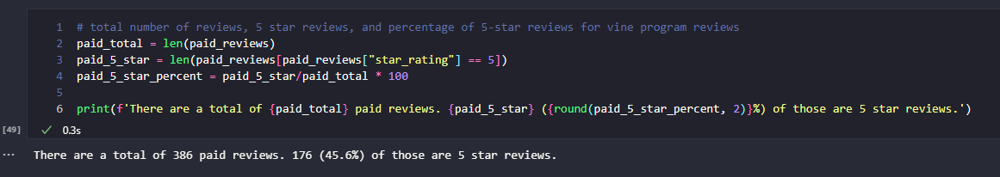
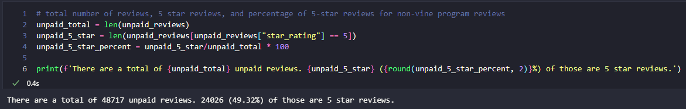

# amazon-vine-analysis
Data Analysis Bootcamp - Week 16

## Overview
The purpose of this repo was to practice our ETL process in the cloud, using Spark in a Google Colab notebook and AWS RDS to save our transformed data. 

Amazon Vine is a program where a company can pay to have their product sent to people who then use it and are required to post a review. We are looking at review data from Amazon to help determine if there is any positive bias in reviews from their Vine program vs reviews from normal purchasers who didn't receive the product for free.

## Resources
We picked the data we wanted to from [this index](https://s3.amazonaws.com/amazon-reviews-pds/tsv/index.txt). Since I recently bought a watering can from Amazon I chose to go with the "Lawn and Garden" dataset, found at [this link](https://s3.amazonaws.com/amazon-reviews-pds/tsv/amazon_reviews_us_Lawn_and_Garden_v1_00.tsv.gz).

## Results
* How many Vine reviews and non-Vine reviews were there?

    * There were 386 Vine program reviews and 48,717 non-Vine reviews in this lawn and garden dataset (after we had filtered down to reviews with >= 20 votes and rated as >=50% helpful.)

* How many Vine reviews were 5 stars? How many non-Vine reviews were 5 stars?

    * There were 176 5-star reviews in the Vine dataset and 24,026 5-star reviews in the non-Vine dataset.

* What percentage of Vine reviews were 5 stars? What percentage of non-Vine reviews were 5 stars?

    * 45.6% of reviews in the Vine dataset were 5-star reviews and 49.3% of reviews in the non-Vine dataset were 5-star reviews.

### Images of the Final Summary
  
 

## Summary

### State if there is any positivity bias for reviews in the Vine program.

Just looking at 5-star reviews it seems like there isn't a noticeable positivity bias in the Vine program. 45.6% of the Vine reviews were 5 stars and 49.3% fo the non-Vine reviews were 5 stars. Without any deeper analysis these feel like similar enough percentages to not raise any eyebrows.

### Provide one additional analysis that you could do with the dataset to support your statement.

An additional analysis we could run would be to take the average of all star ratings for both datasets and run a two-sample T-test to see if the means are statistically different from each other. This would help give us a fuller picture since we'd be looking at all reviews after just looking at the percentage of 5-star reviews.